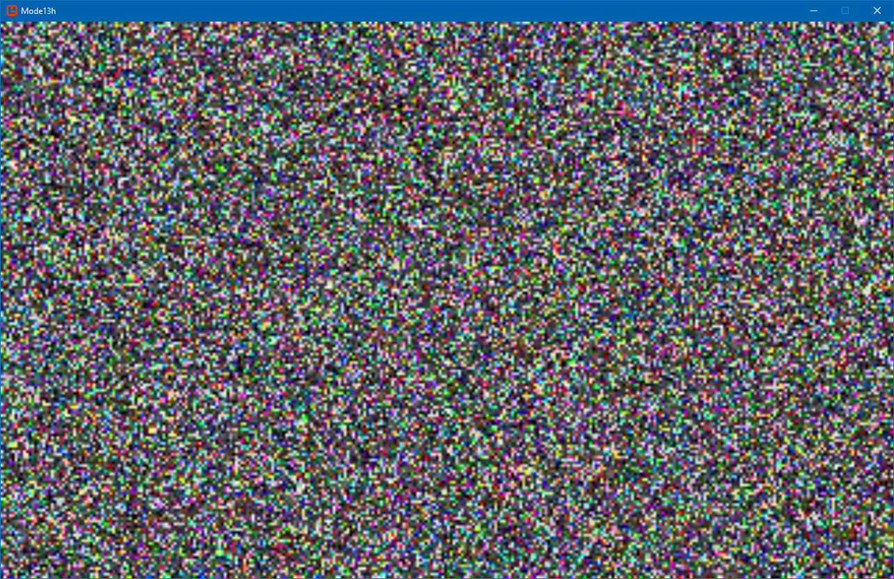

Mode13h - A programming helper
===================================
Version 1.1 Released by [Alexandru Dorobanțiu](http://alex.dorobantiu.ro) on 8.12.2024

### Details
If you don't know what Mode13h is, check https://en.wikipedia.org/wiki/Mode_13h
 
The purpose of the project is to separate the boilerplate code needed to use the graphics card like the mode 13h was enabled, and allow focusing on writing the business logic.
The purpose is not to have a high performance emulator, but to have a simple and easy to use framework.
For some simple examples on how to use this project, check out the (DemoGame, Fire, Lines) classes.

### Technology:
 - Written in plain **C#** using **Visual Studio 2015**
 - It is implemented on top of the MonoGame framework https://en.wikipedia.org/wiki/MonoGame http://www.monogame.net/
 
In order to compile the project as is, you need to install the MonoGame framework first.

#### Screenshot

 
 
[][CreativeCommonsLicence]
 
This work is licensed under a [Creative Commons Attribution-NonCommercial-ShareAlike 4.0 International License][CreativeCommonsLicence]

[CreativeCommonsLicence]: http://creativecommons.org/licenses/by-nc-sa/4.0/
